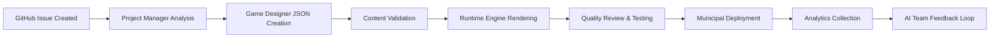

# Integration Guide - DigiNativa Runtime Engine 🔗

**Seamless Integration with AI Content Creation Team and Municipal Deployment Systems**

This guide ensures perfect integration between the DigiNativa Runtime Engine and the AI-powered content creation ecosystem, enabling automated game development and deployment.

---

## 🏗️ Integration Architecture Overview

### **System Integration Map**
```
┌─────────────────────────────────────────────────────────────────┐
│                    DigiNativa Ecosystem                         │
├─────────────────────────────────────────────────────────────────┤
│  AI Content Creation Team (devteam repository)                  │
│  ┌─────────────────┐ ┌─────────────────┐ ┌─────────────────┐     │
│  │ Project Manager │ │ Game Designer   │ │ Quality Reviewer│     │
│  │ - GitHub Issues │ │ - JSON Manifest │ │ - Final Approval│     │
│  │ - Story Analysis│ │ - Scene Creation│ │ - Deployment    │     │
│  └─────────────────┘ └─────────────────┘ └─────────────────┘     │
├─────────────────────────────────────────────────────────────────┤
│                     Integration Layer                           │
│  ┌─────────────────────────────────────────────────────────────┐ │
│  │ • Content Validation Pipeline                               │ │
│  │ • Automatic Game Manifest Generation                       │ │
│  │ • Runtime Engine Deployment                                │ │
│  │ • Analytics Feedback Loop                                  │ │
│  └─────────────────────────────────────────────────────────────┘ │
├─────────────────────────────────────────────────────────────────┤
│  Runtime Engine (diginative_runtime_engine repository)          │
│  ┌─────────────────┐ ┌─────────────────┐ ┌─────────────────┐     │
│  │ StrategyPlayHost│ │ Scene Components│ │ Analytics Engine│     │
│  │ - Game Execution│ │ - UI Rendering  │ │ - Learning Data │     │
│  └─────────────────┘ └─────────────────┘ └─────────────────┘     │
├─────────────────────────────────────────────────────────────────┤
│                    Municipal Deployment                         │
│  ┌─────────────────────────────────────────────────────────────┐ │
│  │ • Netlify/Municipal Hosting                                 │ │
│  │ • User Authentication Integration                           │ │
│  │ • Learning Management System APIs                          │ │
│  │ • Compliance and Security Monitoring                       │ │
│  └─────────────────────────────────────────────────────────────┘ │
└─────────────────────────────────────────────────────────────────┘
```

---

## 🤖 AI Team Integration Workflow

### **Content Creation Pipeline**


### **Automated Content Deployment**
The AI team creates game content that automatically integrates with the runtime engine through a standardized workflow:

```typescript
// AI Team Output Format
interface AIGameDelivery {
  gameManifest: GameManifest;        // Complete JSON game definition
  metadata: {
    sourceIssue: string;             // GitHub issue reference
    aiTeamVersion: string;           // AI team version info
    validationStatus: 'passed' | 'pending' | 'failed';
    deploymentTarget: 'development' | 'production';
  };
  qualityChecks: {
    contentValidation: boolean;      // Schema compliance
    accessibilityCompliance: boolean; // WCAG 2.1 AA check
    performanceOptimization: boolean; // Load time requirements
    municipalContextAccuracy: boolean; // Swedish context validation
  };
}
```

### **Integration Touch Points**

#### **1. Project Manager → Engine Requirements**
The AI Project Manager analyzes GitHub issues and generates engine-compatible requirements:

```typescript
// Integration: Project Manager Output
interface EngineRequirements {
  gameId: string;                    // Unique game identifier
  targetPersona: 'anna-svensson';    // Always Anna for municipal focus
  learningObjectives: string[];      // Specific knowledge goals
  scenarioTypes: SceneType[];        // Required scene components
  durationConstraint: number;        // Max 7 minutes (420 seconds)
  accessibilityRequirements: AccessibilityFeature[]; // WCAG compliance
  integrationEndpoints: {
    analytics: string;               // Where to send learning data
    authentication: string;         // Municipal SSO integration
    contentManagement: string;      // Game delivery system
  };
}
```

#### **2. Game Designer → JSON Manifest**
The AI Game Designer creates runtime engine compatible game manifests:

```typescript
// Integration: Game Designer Output
interface GameManifestCreation {
  manifest: GameManifest;           // Complete game definition
  validationReport: {
    schemaCompliance: boolean;      // Matches runtime engine schema
    annaPersonaAlignment: number;   // 0-100 score for Anna optimization
    municipalContextAccuracy: number; // 0-100 score for Swedish context
    estimatedCompletionTime: number; // Predicted time in seconds
  };
  testingInstructions: {
    criticalUserPaths: string[];    // Key flows to test
    accessibilityChecklist: string[]; // A11y items to verify
    performanceExpectations: {
      loadTime: number;             // Expected initial load
      interactionDelay: number;     // Expected response time
    };
  };
}
```

#### **3. Quality Reviewer → Deployment Approval**
The AI Quality Reviewer validates integration compatibility:

```typescript
// Integration: Quality Reviewer Validation
interface DeploymentApproval {
  gameId: string;
  approvalStatus: 'approved' | 'conditional' | 'rejected';
  engineCompatibility: {
    schemaVersion: string;          // Runtime engine version requirement
    performanceCompliance: boolean; // Meets engine performance budgets
    accessibilityCompliance: boolean; // WCAG 2.1 AA verified
    municipalReadiness: boolean;    // Ready for municipal deployment
  };
  deploymentInstructions: {
    targetEnvironment: 'development' | 'production';
    configurationOverrides: Record<string, any>; // Engine customizations
    monitoringRequirements: string[]; // What to watch post-deployment
  };
  rollbackPlan: {
    conditions: string[];           // When to rollback
    procedure: string[];            // How to rollback safely
  };
}
```

---

## 🔄 Automated Integration Pipeline

### **Content Validation Webhook**
```typescript
// Webhook: AI Team → Runtime Engine Validation
const validateAIContent = async (aiDelivery: AIGameDelivery) => {
  // 1. Schema validation
  const schemaValidation = await validateGameManifest(aiDelivery.gameManifest);
  if (!schemaValidation.valid) {
    return {
      status: 'rejected',
      reason: 'Schema validation failed',
      errors: schemaValidation.errors
    };
  }
  
  // 2. Performance pre-check
  const performanceEstimate = estimateGamePerformance(aiDelivery.gameManifest);
  if (performanceEstimate.estimatedLoadTime > 2000) {
    return {
      status: 'conditional',
      reason: 'Performance optimization required',
      suggestions: performanceEstimate.optimizations
    };
  }
  
  // 3. Accessibility validation
  const a11yValidation = await validateAccessibilityCompliance(aiDelivery.gameManifest);
  if (!a11yValidation.compliant) {
    return {
      status: 'rejected',
      reason: 'Accessibility compliance failed',
      issues: a11yValidation.violations
    };
  }
  
  // 4. Municipal context validation
  const contextValidation = validateMunicipalContext(aiDelivery.gameManifest);
  if (contextValidation.score < 85) {
    return {
      status: 'conditional',
      reason: 'Municipal context accuracy below threshold',
      improvements: contextValidation.suggestions
    };
  }
  
  return {
    status: 'approved',
    engineConfiguration: generateEngineConfig(aiDelivery.gameManifest),
    deploymentReadiness: true
  };
};
```

### **Automatic Deployment Pipeline**
```yaml
# GitHub Actions: AI Content → Runtime Engine Deployment
name: AI Content Integration and Deployment

on:
  repository_dispatch:
    types: [ai-content-ready]

jobs:
  validate-content:
    runs-on: ubuntu-latest
    steps:
      - name: Validate AI Game Manifest
        id: validate
        run: |
          curl -X POST ${{ secrets.ENGINE_VALIDATION_ENDPOINT }} \
            -H "Content-Type: application/json" \
            -d '${{ github.event.client_payload.gameManifest }}'
      
      - name: Check Validation Result
        if: steps.validate.outputs.status != 'approved'
        run: |
          echo "Content validation failed: ${{ steps.validate.outputs.reason }}"
          exit 1

  deploy-to-engine:
    needs: validate-content
    runs-on: ubuntu-latest
    steps:
      - name: Deploy to Development Engine
        if: github.event.client_payload.target == 'development'
        run: |
          # Deploy to development runtime engine instance
          curl -X POST ${{ secrets.DEV_ENGINE_DEPLOY_ENDPOINT }} \
            -H "Authorization: Bearer ${{ secrets.ENGINE_API_TOKEN }}" \
            -d '${{ github.event.client_payload.gameManifest }}'
      
      - name: Deploy to Production Engine
        if: github.event.client_payload.target == 'production'
        run: |
          # Deploy to production runtime engine instance
          curl -X POST ${{ secrets.PROD_ENGINE_DEPLOY_ENDPOINT }} \
            -H "Authorization: Bearer ${{ secrets.ENGINE_API_TOKEN }}" \
            -d '${{ github.event.client_payload.gameManifest }}'

  notify-deployment:
    needs: deploy-to-engine
    runs-on: ubuntu-latest
    steps:
      - name: Notify AI Team
        run: |
          # Send deployment success notification back to AI team
          curl -X POST ${{ secrets.AI_TEAM_WEBHOOK }} \
            -H "Content-Type: application/json" \
            -d '{
              "status": "deployed",
              "gameId": "${{ github.event.client_payload.gameId }}",
              "deploymentUrl": "${{ steps.deploy.outputs.gameUrl }}",
              "monitoringDashboard": "${{ steps.deploy.outputs.analyticsUrl }}"
            }'
```

---

## 📊 Analytics Integration & Feedback Loop

### **Learning Data Collection**
The runtime engine automatically sends learning analytics back to the AI team for continuous improvement:

```typescript
// Analytics: Runtime Engine → AI Team Feedback
interface LearningAnalytics {
  gameId: string;
  sessionData: {
    userId: string;                 // Anonymous user identifier
    completionRate: number;         // 0-100% completion
    timeSpent: number;              // Actual time in seconds
    sceneMetrics: SceneAnalytics[]; // Per-scene performance
    userChoices: UserChoice[];      // Decision points selected
    strugglingPoints: string[];     // Where users had difficulty
  };
  aggregateMetrics: {
    totalSessions: number;          // Total game sessions
    averageCompletion: number;      // Average completion rate
    averageScore: number;           // Average final score
    dropoffPoints: string[];        // Common exit points
    popularChoices: ChoiceMetrics[]; // Most selected options
  };
  improvementSuggestions: {
    contentOptimizations: string[]; // Suggested content changes
    performanceIssues: string[];    // Technical problems identified
    accessibilityFeedback: string[]; // A11y improvements needed
  };
}

// Automatic feedback to AI team
const sendAnalyticsToAITeam = async (analytics: LearningAnalytics) => {
  await fetch(`${AI_TEAM_WEBHOOK}/analytics-feedback`, {
    method: 'POST',
    headers: {
      'Content-Type': 'application/json',
      'Authorization': `Bearer ${AI_TEAM_API_TOKEN}`
    },
    body: JSON.stringify({
      type: 'learning-analytics',
      data: analytics,
      timestamp: new Date().toISOString(),
      source: 'diginativa-runtime-engine'
    })
  });
};
```

### **AI Team Content Optimization**
The AI team uses runtime engine analytics to improve future content:

```typescript
// AI Team: Analytics → Content Improvement
interface ContentOptimizationInput {
  currentGameManifest: GameManifest;
  analyticsData: LearningAnalytics;
  optimizationGoals: {
    increaseCompletion: boolean;    // Focus on completion rate
    improveEngagement: boolean;     // Focus on user engagement
    enhanceAccessibility: boolean; // Focus on accessibility
    optimizePerformance: boolean;   // Focus on technical performance
  };
}

interface ContentOptimizationOutput {
  optimizedManifest: GameManifest; // Improved game definition
  changes: {
    scenesModified: string[];       // Which scenes were changed
    reasonsForChanges: string[];    // Why changes were made
    expectedImprovements: string[]; // What improvements are expected
  };
  abTestConfiguration: {
    testVariants: GameManifest[];   // A/B test versions
    successMetrics: string[];       // What to measure
    testDuration: number;           // How long to run test
  };
}
```

---

## 🚀 Municipal Deployment Integration

### **Municipal System Integration**
```typescript
// Municipal Integration: Runtime Engine → Municipal Systems
interface MunicipalIntegration {
  authenticationProvider: {
    type: 'SAML' | 'OAuth' | 'Municipal-SSO';
    endpoint: string;
    configuration: Record<string, any>;
  };
  learningManagementSystem: {
    type: string;                   // Municipal LMS type
    apiEndpoint: string;            // Where to send completion data
    credentialsMapping: {           // How to map engine certificates
      engineCertificate: string;
      municipalCredential: string;
    };
  };
  reportingIntegration: {
    dashboardUrl: string;           // Municipal analytics dashboard
    dataFormat: 'JSON' | 'XML' | 'CSV'; // Preferred data format
    scheduledReports: {
      frequency: 'daily' | 'weekly' | 'monthly';
      recipients: string[];         // Municipal administrators
      metrics: string[];            // What data to include
    };
  };
}

// Deployment configuration generator
const generateMunicipalConfig = (municipality: Municipality): MunicipalIntegration => {
  return {
    authenticationProvider: {
      type: municipality.ssoType,
      endpoint: municipality.authEndpoint,
      configuration: {
        entityId: `diginativa-${municipality.id}`,
        certificatePath: `/certificates/${municipality.id}.pem`,
        loginUrl: `${municipality.authEndpoint}/login`,
        logoutUrl: `${municipality.authEndpoint}/logout`
      }
    },
    learningManagementSystem: {
      type: municipality.lmsProvider,
      apiEndpoint: municipality.lmsApiUrl,
      credentialsMapping: {
        engineCertificate: 'diginativa_completion',
        municipalCredential: municipality.completionCredentialType
      }
    },
    reportingIntegration: {
      dashboardUrl: `https://analytics.diginativa.se/${municipality.id}`,
      dataFormat: municipality.preferredDataFormat,
      scheduledReports: {
        frequency: municipality.reportingFrequency,
        recipients: municipality.analyticsContacts,
        metrics: [
          'completion_rates',
          'learning_outcomes',
          'user_engagement',
          'accessibility_usage'
        ]
      }
    }
  };
};
```

### **Compliance and Security Integration**
```typescript
// Security: Runtime Engine → Municipal Compliance
interface ComplianceIntegration {
  dataProtection: {
    gdprCompliance: boolean;        // GDPR compliance verified
    dataRetentionPolicy: number;    // Days to retain learning data
    anonymizationLevel: 'none' | 'partial' | 'full';
    dataProcessingAgreement: string; // Legal agreement reference
  };
  accessibilityCompliance: {
    wcagLevel: 'AA' | 'AAA';       // WCAG compliance level
    municipalStandards: string[];   // Additional municipal requirements
    auditSchedule: 'monthly' | 'quarterly' | 'annually';
    reportingContact: string;       // Who receives a11y reports
  };
  securityRequirements: {
    encryptionStandard: string;     // Encryption requirements
    auditLogging: boolean;          // Security audit logging
    penetrationTesting: {
      frequency: string;            // How often to test
      approvedVendors: string[];    // Who can perform tests
    };
    incidentResponse: {
      contactEmail: string;         // Emergency contact
      escalationProcedure: string[]; // Steps to follow
    };
  };
}
```

---

## 🔧 Development Environment Integration

### **Local Development Setup**
```bash
# Development Environment: AI Team + Runtime Engine
git clone https://github.com/jhonnyo88/devteam.git
git clone https://github.com/jhonnyo88/diginative_runtime_engine.git

# Set up AI team environment
cd devteam
npm install
cp .env.example .env
# Configure AI team environment variables

# Set up runtime engine environment  
cd ../diginative_runtime_engine
npm install
cp .env.example .env
# Configure engine environment variables

# Start integrated development
npm run dev:integrated  # Starts both AI team and engine with hot reloading
```

### **Testing Integration**
```typescript
// Integration Testing: AI Team Output → Runtime Engine
describe('AI Team → Runtime Engine Integration', () => {
  it('validates AI-generated game manifests', async () => {
    // Generate content using AI team
    const aiGameManifest = await generateGameFromAI({
      strategy: 'sweden-digital-strategy',
      targetPersona: 'anna-svensson',
      duration: 420
    });
    
    // Validate with runtime engine
    const validation = await validateGameManifest(aiGameManifest);
    expect(validation.valid).toBe(true);
    expect(validation.errors).toHaveLength(0);
  });
  
  it('renders AI-generated content correctly', async () => {
    const aiGameManifest = await generateGameFromAI({
      strategy: 'gdpr-compliance',
      scenarios: ['email-handling', 'citizen-requests']
    });
    
    render(<StrategyPlayHost gameManifest={aiGameManifest} />);
    
    // Verify all AI-generated scenes render
    expect(screen.getByText('GDPR för Kommunal Verksamhet')).toBeInTheDocument();
    expect(screen.getByText('E-posthantering')).toBeInTheDocument();
    expect(screen.getByText('Medborgarförfrågningar')).toBeInTheDocument();
  });
  
  it('collects analytics for AI feedback loop', async () => {
    const analyticsCallback = vi.fn();
    const aiGameManifest = await generateGameFromAI({
      strategy: 'accessibility-compliance'
    });
    
    render(
      <StrategyPlayHost 
        gameManifest={aiGameManifest}
        onAnalyticsEvent={analyticsCallback}
      />
    );
    
    // Complete game flow
    await userEvent.click(screen.getByText('Börja spel'));
    await userEvent.click(screen.getByText('Korrekt hantering'));
    await userEvent.click(screen.getByText('Avsluta'));
    
    // Verify analytics sent to AI team
    expect(analyticsCallback).toHaveBeenCalledWith(
      expect.objectContaining({
        type: 'game_completion',
        gameId: aiGameManifest.gameId,
        completionRate: 100
      })
    );
  });
});
```

---

## 📈 Monitoring and Health Checks

### **Integration Health Dashboard**
```typescript
// Monitoring: System Integration Health
interface IntegrationHealth {
  aiTeamConnection: {
    status: 'healthy' | 'degraded' | 'down';
    lastSuccessfulDeployment: string; // ISO timestamp
    pendingContent: number;         // Content waiting for deployment
    errorRate: number;              // Percentage of failed integrations
  };
  runtimeEnginePerformance: {
    averageLoadTime: number;        // Average game load time
    errorRate: number;              // Percentage of failed game loads
    activeGames: number;            // Currently deployed games
    userSessions: number;           // Active user sessions
  };
  municipalIntegrations: {
    connectedMunicipalities: number; // Number of connected municipalities
    authenticationFailures: number; // SSO failures in last 24h
    dataDeliveryFailures: number;   // Failed analytics deliveries
    complianceAlerts: string[];     // Any compliance issues
  };
}

// Automated health monitoring
const monitorIntegrationHealth = async (): Promise<IntegrationHealth> => {
  const [aiTeamHealth, engineHealth, municipalHealth] = await Promise.all([
    checkAITeamConnection(),
    checkRuntimeEnginePerformance(),
    checkMunicipalIntegrations()
  ]);
  
  return {
    aiTeamConnection: aiTeamHealth,
    runtimeEnginePerformance: engineHealth,
    municipalIntegrations: municipalHealth
  };
};

// Alert thresholds
const HEALTH_THRESHOLDS = {
  maxErrorRate: 0.05,              // 5% maximum error rate
  maxLoadTime: 2000,               // 2 second maximum load time
  maxPendingContent: 5,            // 5 maximum pending deployments
  maxAuthFailures: 10,             // 10 maximum auth failures per day
} as const;
```

---

This integration guide ensures seamless collaboration between the AI content creation team and the runtime engine, enabling automated, high-quality educational game deployment at scale across Swedish municipalities.

🔗 **Integrate. Automate. Scale. 🇸🇪**