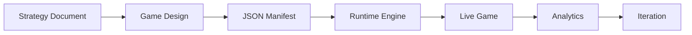

# DigiNativa Runtime Engine 🎮

**The Swedish Public Sector's Educational Game Platform**

A revolutionary React-based runtime engine that transforms JSON manifests into immersive, accessible educational experiences. Built for scale, designed for impact.

---

## 🎯 Vision & Business Impact

The DigiNativa Runtime Engine enables **80% faster game development** by separating content creation from technical implementation. One engine powers unlimited educational games across Swedish municipalities.

### **Revenue Multiplier Strategy**
- **1 Engine → Unlimited Games**: Build once, deploy everywhere
- **Rapid Content Creation**: AI teams generate JSON, engine renders games
- **Municipal Scaling**: 3 pilots → 290 Swedish municipalities
- **European Expansion**: Template for EU public sector transformation

---

## 🏗️ Architecture Overview

```
📱 Educational Game = 🛠️ Runtime Engine + 📋 JSON Manifest
```

### **Core Components**
- **StrategyPlayHost**: Central game orchestrator
- **Scene Components**: DialogueScene, QuizScene, AssessmentScene
- **Progress Tracking**: Real-time learning analytics
- **Accessibility Engine**: WCAG 2.1 AA compliance built-in

### **JSON-Driven Content**
```json
{
  "gameId": "sweden-digital-strategy",
  "metadata": {
    "title": "Sveriges Digitaliseringsstrategi",
    "duration": "7 minutes",
    "learningObjectives": ["Policy understanding", "Practical application"]
  },
  "scenes": [...]
}
```

---

## 🚀 Quick Start

### **For Developers**
```bash
git clone https://github.com/jhonnyo88/diginative_runtime_engine
cd diginative_runtime_engine
npm install
npm run dev
```

### **For Game Designers**
1. Read `GAME_DESIGN_GUIDE.md`
2. Use JSON schema from `CONTENT_SCHEMA.md`
3. Create game manifest
4. Test in Storybook environment

---

## 📋 Documentation Structure

| Document | Purpose | Audience |
|----------|---------|----------|
| `CLAUDE.md` | Development instructions with equity stakes | **Developers** |
| `GAME_DESIGN_GUIDE.md` | Game creation framework | **Designers** |
| `TECHNICAL_SPECIFICATION.md` | Architecture & implementation | **Developers** |
| `CONTENT_SCHEMA.md` | JSON manifest specifications | **Both** |
| `DEVELOPMENT_ROADMAP.md` | Project phases & milestones | **Leadership** |
| `INTEGRATION_GUIDE.md` | AI team workflow integration | **DevOps** |

---

## 🎯 Target Persona: Anna Svensson

**Municipal Administrator, 45, Malmö**
- Limited time (7-minute learning sessions)
- Policy-focused learning needs
- Mobile-first accessibility requirements
- Practical, actionable knowledge goals

All games built with this engine optimize for Anna's workflow and learning style.

---

## 🛠️ Development Standards

### **Performance Requirements**
- **Loading**: < 2 seconds initial load
- **Interactions**: < 100ms response time
- **Mobile**: Smooth on iPhone 12 and newer
- **Bundle Size**: < 500KB gzipped

### **Accessibility Standards**
- **WCAG 2.1 AA** compliance minimum
- **Keyboard navigation** for all interactions
- **Screen reader** compatibility
- **Color contrast** 4.5:1 minimum ratio

### **Code Quality**
- **TypeScript**: 100% typed codebase
- **Testing**: 90%+ code coverage
- **Storybook**: All components documented
- **Performance**: Lighthouse score 90+

---

## 🎮 Game Development Workflow



1. **Content Creation**: Design learning scenarios in JSON
2. **Engine Rendering**: Automatic UI generation
3. **Quality Assurance**: Automated accessibility & performance testing
4. **Deployment**: Instant publishing to municipal platforms
5. **Analytics**: Real-time learning outcome tracking

---

## 📊 Success Metrics

### **Technical Excellence**
- **Reusability**: Support 10+ different game types
- **Performance**: Consistent 90+ Lighthouse scores
- **Accessibility**: 100% WCAG 2.1 AA compliance
- **Developer Experience**: < 1 day setup for new games

### **Business Impact**
- **Speed**: 80% reduction in game development time
- **Scale**: Power 50+ Swedish municipalities
- **Quality**: 95%+ user satisfaction scores
- **Innovation**: European leadership in public sector digital learning

---

## 🤝 Equity & Success Partnership

**Developers and Designers are equity partners in DigiNativa's success.**

Your work on this engine directly impacts:
- Revenue growth through faster game deployment
- Market expansion across Swedish municipalities
- Competitive advantage in European public sector
- Long-term platform value and licensing opportunities

Excellence in engine development = Maximum equity value for all partners.

---

## 🔗 Related Projects

- **AI Content Team**: [diginativa-game](https://github.com/jhonnyo88/diginativa-game)
- **Live Demo**: [diginativa-game-dev.netlify.app](https://diginativa-game-dev.netlify.app)
- **Content Examples**: See `examples/` directory

---

## 📞 Support & Community

- **Technical Questions**: See `TECHNICAL_SPECIFICATION.md`
- **Design Questions**: See `GAME_DESIGN_GUIDE.md`
- **Integration Support**: See `INTEGRATION_GUIDE.md`
- **Business Strategy**: Direct contact with Johan (jhonnyo88@github)

---

**Built with 🇸🇪 Swedish innovation for global educational transformation.**