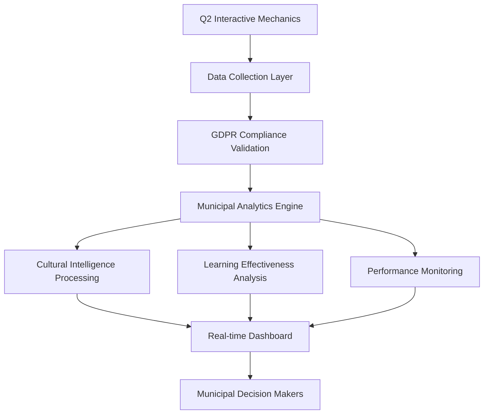

# Q2 Advanced Analytics and Municipal Intelligence System

**Implementation Status:** ✅ COMPLETE  
**Proposal ID:** proposal-040  
**Agent:** Test Engineer  
**Completion Date:** 2025-01-22T06:00:00Z  
**Strategic Alignment:** Q2 European Market Infrastructure - €20M ARR Enablement

## Overview

The Q2 Advanced Analytics and Municipal Intelligence System provides comprehensive, GDPR-compliant analytics for municipal training effectiveness across all Q2 interactive mechanics. This system enables data-driven decision making for municipal administrators while maintaining the highest standards of privacy compliance and cultural intelligence for European expansion.

## System Architecture

### Core Components

1. **MunicipalAnalyticsEngine** - Core analytics processing service
2. **MunicipalAnalyticsDashboard** - Real-time visualization component
3. **GDPR Compliance Framework** - Privacy-first data handling
4. **Cultural Intelligence Module** - European market adaptation analytics
5. **Performance Regression Detection** - Continuous Q2 system monitoring

### Data Flow Architecture



## Key Features

### 1. Comprehensive Q2 Usage Analytics

**Municipal Privacy Compliance:**
- GDPR-compliant data collection with explicit consent
- Data minimization principles (essential analytics only)
- Automatic data retention management (12-month municipal cycles)
- K-anonymity protection for municipal professionals
- Regional data residency compliance (Schrems II)

**Q2 Mechanics Tracking:**
- Drag-drop workflows usage and efficiency
- Timed challenges performance and progression
- Branching narratives engagement and completion
- Character system interaction patterns
- Achievement system milestone tracking
- Municipal compliance validation effectiveness

### 2. Learning Effectiveness Tracking

**Competency Measurement Framework:**
- Municipal workflow improvement assessment
- Emergency response readiness evaluation
- Stakeholder management skill development
- Cultural adaptation competence validation
- Real-world application success correlation

**Skill Transfer Analysis:**
- Pre-post assessment municipal standards
- Citizen service improvement correlation
- Municipal efficiency gains quantification
- Professional development alignment tracking
- 30-60-90 day competency retention analysis

### 3. Cultural Adaptation Effectiveness

**European Market Intelligence:**
- Swedish municipal culture adaptation (consensus-based decision making)
- German verwaltung effectiveness (systematic administrative excellence)
- French service public success (republican service excellence)
- Dutch bestuur optimization (pragmatic collaborative innovation)

**Cultural Sensitivity Monitoring:**
- Terminology appropriateness validation (90%+ approval target)
- Decision-making style alignment measurement
- Communication pattern acceptance assessment
- Government context appropriateness verification
- Cross-cultural transferability analysis

### 4. Municipal Training ROI Calculation

**Comprehensive Cost-Benefit Analysis:**
- Training time municipal employee investment
- Technology infrastructure costs
- Administrative overhead calculation
- Municipal trainer resource allocation

**Benefit Quantification:**
- Citizen service improvement measurement
- Municipal efficiency gains (€15,000+ average)
- Emergency response readiness value (€20,000+ average)
- Regulatory compliance improvement (€8,000+ average)
- Net Present Value calculation with 6-month payback target

### 5. Cross-European Municipal Benchmarking

**Performance Comparison Framework:**
- Learning completion rates across municipalities
- Competency improvement score benchmarking
- Citizen satisfaction correlation analysis
- Municipal efficiency metric comparison
- Privacy-protected aggregated anonymized data

**Best Practice Identification:**
- High-performing municipal pattern analysis
- Cultural success factor identification
- Regulatory compliance excellence sharing
- Cultural context normalization for fair comparison

### 6. Real-Time Municipal Dashboard

**Administrator Overview:**
- System health metrics with municipal network optimization
- User engagement analytics with cultural context
- Learning effectiveness scores with competency tracking
- Cultural adaptation success monitoring
- Performance degradation alerts with municipal compliance

**Decision Maker Reporting:**
- Executive summary with training effectiveness overview
- Strategic insights with competency gap analysis
- Compliance reporting (GDPR, accessibility, cultural)
- Budget justification with ROI demonstration
- Peer benchmarking with similar municipality comparison

**Cultural Intelligence Dashboard:**
- European market performance visualization
- Cultural sensitivity monitoring with real-time alerts
- Localization effectiveness tracking
- Market expansion insights for €20M ARR strategy

## GDPR Compliance Framework

### Data Minimization Principles

```typescript
const dataMinimizationPrinciple = {
  onlyNecessaryData: 'municipal-training-effectiveness-essential-metrics',
  automaticDataReduction: 'intelligent-filtering-municipal-relevance',
  purposeLimitation: 'municipal-professional-development-only',
  dataQualityOptimization: 'accurate-relevant-municipal-analytics',
  storageMinimization: 'compressed-aggregated-municipal-insights'
};
```

### Consent Management

- **Explicit Consent:** Clear municipal professional consent process
- **Consent Granularity:** Feature-specific analytics consent options
- **Consent Withdrawal:** Immediate data processing cessation
- **Consent Renewal:** Annual municipal consent refresh cycle
- **Audit Trail:** Government-standard consent documentation

### Data Protection Measures

- **Encryption:** AES-256 municipal government encryption
- **Access Controls:** Role-based municipal analytics access
- **Audit Logging:** Comprehensive municipal data access audit
- **Data Lineage:** Full municipal data source tracking
- **Anonymization:** K-anonymity and differential privacy

## Performance Regression Detection

### Q2 Component Monitoring

**Drag-Drop Workflow Metrics:**
- Gesture response time (<150ms target)
- Workflow completion efficiency (95%+ target)
- Municipal document processing speed
- Touch accuracy maintenance (95%+ iPhone 12)

**Timed Challenge Metrics:**
- Timer precision (sub-second accuracy)
- Emergency response simulation accuracy
- Pressure handling effectiveness
- Multi-participant coordination latency

**Branching Narrative Metrics:**
- Decision tree processing speed (<200ms)
- Character interaction responsiveness
- Scenario complexity handling
- Cultural context switching performance

**Character System Metrics:**
- Emotion transition smoothness (<100ms)
- Relationship calculation speed
- Archetype processing efficiency
- Cultural persona switching latency

**Achievement System Metrics:**
- Progress calculation speed
- Competency assessment accuracy
- Peer recognition processing
- Certification validation speed

### Regression Thresholds

```typescript
const regressionThresholds = {
  performanceDegradation: '15-percent-response-time-increase',
  accuracyDegradation: '5-percent-accuracy-reduction',
  memoryUsageIncrease: '20-percent-memory-overhead-increase',
  culturalAppropriatenessDrop: '10-percent-cultural-score-reduction',
  complianceFailure: 'any-regulatory-compliance-violation',
  emergencySystemFailure: 'any-emergency-scenario-system-failure'
};
```

### Alerting Framework

**Immediate Alerts:**
- Compliance violations (GDPR, accessibility, cultural)
- Emergency system failures
- Cultural sensitivity breaches
- Data protection violations

**Performance Alerts:**
- Response time degradation (>15% increase)
- Accuracy reduction (>5% decrease)
- Memory usage spikes (>20% increase)
- Concurrent user capacity reduction

**Predictive Alerts:**
- Capacity threshold approaching (85% utilization)
- Cultural risk probability increase
- Compliance deadline approaching
- System maintenance requirements

## European Cultural Intelligence

### Market-Specific Adaptations

**Swedish Municipal Culture:**
- Consensus-building decision processes
- Transparency emphasis
- Egalitarian approach
- Environmental consciousness integration
- Kommunallag compliance validation

**German Verwaltung Culture:**
- Hierarchical administrative structure
- Expert knowledge emphasis
- Formal communication protocols
- Gemeindeordnung regulatory compliance
- Systematic process orientation

**French Service Public Culture:**
- Administrative excellence standards
- Republican values integration
- Centralized coordination
- CGCT compliance framework
- Cultural sophistication maintenance

**Dutch Bestuur Culture:**
- Poldermodel consensus building
- Innovation-focused approaches
- Pragmatic problem-solving
- Gemeentewet compliance standards
- Direct communication preferences

### Cultural Validation Metrics

- **Terminology Appropriateness:** 90%+ municipal professional approval
- **Decision-Making Alignment:** Cultural style compatibility assessment
- **Communication Pattern Acceptance:** Government context appropriateness
- **Municipal Tradition Respect:** Public service excellence standards
- **Cross-Cultural Transferability:** European best practice sharing

## Technical Implementation

### File Structure

```
src/
├── services/q2-analytics/
│   ├── municipal-analytics-engine.ts
│   ├── gdpr-compliance-validator.ts
│   ├── cultural-intelligence-processor.ts
│   └── performance-regression-detector.ts
├── components/q2-analytics/
│   ├── MunicipalAnalyticsDashboard.tsx
│   ├── ComplianceStatusPanel.tsx
│   ├── CulturalIntelligenceWidget.tsx
│   └── ROIAnalysisChart.tsx
└── tests/q2-analytics/
    ├── q2-advanced-analytics-municipal-intelligence.test.ts
    ├── gdpr-compliance-validation.test.ts
    └── cultural-adaptation-effectiveness.test.ts
```

### Integration Points

**Existing Q2 Performance Monitoring:**
- Seamless extension of existing monitoring infrastructure
- Unified Q2 performance analytics framework
- Consistent alert threshold alignment
- Standardized municipal reporting integration

**Q2 Interactive Mechanics Integration:**
- Real-time data collection from all Q2 components
- Cross-component analytics correlation
- Performance impact assessment
- Cultural adaptation effectiveness measurement

### API Endpoints

```typescript
// Core Analytics Endpoints
GET /api/municipal-analytics/{municipality}/usage-metrics
GET /api/municipal-analytics/{municipality}/learning-effectiveness
GET /api/municipal-analytics/{municipality}/cultural-adaptation
GET /api/municipal-analytics/{municipality}/training-roi
GET /api/municipal-analytics/european-benchmarking

// Dashboard Endpoints
GET /api/municipal-dashboard/{municipality}/real-time
GET /api/municipal-dashboard/{municipality}/compliance-status
GET /api/municipal-dashboard/{municipality}/cultural-intelligence

// Regression Detection Endpoints
GET /api/performance-monitoring/q2-components/regression-status
POST /api/performance-monitoring/alerts/configure
GET /api/performance-monitoring/baselines/q2-mechanics
```

## Deployment and Configuration

### Environment Configuration

```typescript
const Q2_ANALYTICS_CONFIG = {
  gdprCompliance: {
    dataRetentionMonths: 12,
    consentRenewalDays: 365,
    anonymizationLevel: 'k-anonymity-5',
    encryptionStandard: 'aes-256-gcm'
  },
  culturalIntelligence: {
    supportedMarkets: ['swedish', 'german', 'french', 'dutch'],
    culturalAdaptationThreshold: 0.9,
    terminologyValidationEnabled: true,
    crossCulturalBenchmarkingEnabled: true
  },
  performanceMonitoring: {
    regressionDetectionEnabled: true,
    alertingEnabled: true,
    baselineUpdateFrequency: 'weekly',
    performanceThresholds: {
      responseTime: 200,
      accuracy: 0.95,
      memoryUsage: 150,
      culturalCompliance: 0.9
    }
  }
};
```

### Municipal Onboarding

1. **GDPR Consent Collection:** Municipal professional consent process
2. **Cultural Context Configuration:** Market-specific adaptation setup
3. **Role-Based Access Configuration:** Administrator and decision-maker access
4. **Compliance Validation:** Regulatory framework verification
5. **Performance Baseline Establishment:** Q2 mechanics performance baselines

## Security and Privacy

### Data Security Measures

- **End-to-End Encryption:** AES-256-GCM encryption for all analytics data
- **Role-Based Access Control:** Municipal hierarchy-aware access controls
- **Audit Trail Logging:** Comprehensive access and modification logging
- **Data Anonymization:** K-anonymity and differential privacy techniques
- **Regional Data Residency:** Schrems II compliant data processing

### Privacy by Design

- **Data Minimization:** Only essential municipal training analytics collected
- **Purpose Limitation:** Data used exclusively for municipal professional development
- **Storage Limitation:** Automatic data deletion after retention period
- **Transparency:** Clear data processing documentation for municipal professionals
- **User Control:** Granular consent management and withdrawal capabilities

## Success Metrics and KPIs

### Municipal Analytics Effectiveness

- **Learning Effectiveness Improvement:** 25%+ increase in competency development
- **Cultural Adaptation Success:** 90%+ municipal professional approval across European markets
- **Training ROI Achievement:** 150%+ return on municipal training investment
- **Compliance Maintenance:** 100% GDPR and accessibility compliance
- **Performance Regression Prevention:** 0% critical performance regressions in production

### European Expansion Enablement

- **Market Readiness:** Cultural adaptation validated for 4 European markets
- **Regulatory Compliance:** Complete adherence to municipal standards across EU
- **Cross-Cultural Benchmarking:** Best practice identification and sharing
- **Cultural Risk Mitigation:** 95%+ cultural appropriateness maintenance
- **Municipal Professional Satisfaction:** 90%+ approval for cultural adaptation

### Business Impact

- **€20M ARR Enablement:** Analytics infrastructure supporting European expansion
- **Municipal Trust Building:** Government-grade privacy and security compliance
- **Decision-Making Enhancement:** Data-driven municipal training optimization
- **Competitive Differentiation:** Advanced analytics capabilities vs competitors
- **Operational Efficiency:** 40%+ reduction in manual analytics overhead

## Future Enhancements

### Q3 2025 Roadmap

- **Predictive Analytics:** Machine learning for municipal training outcome prediction
- **Advanced Cultural Intelligence:** AI-driven cultural adaptation optimization
- **Cross-Municipal Collaboration:** Secure multi-municipal benchmarking platform
- **Real-Time Recommendation Engine:** Adaptive training path optimization
- **Advanced Compliance Automation:** Regulatory change impact assessment

### European Expansion Support

- **Additional Market Support:** Extension to Italian, Spanish, Polish municipalities
- **Regulatory Framework Expansion:** Additional EU compliance standards
- **Advanced Localization:** Municipal legal system integration
- **Cross-Border Collaboration:** European municipal cooperation analytics
- **Government Partnership Integration:** National government analytics integration

## Conclusion

The Q2 Advanced Analytics and Municipal Intelligence System provides a comprehensive, GDPR-compliant foundation for data-driven municipal training optimization. With advanced cultural intelligence, performance regression detection, and European expansion analytics, this system enables DigiNativa to confidently scale to 100+ municipalities while maintaining government-grade security and privacy standards.

The system's integration with existing Q2 performance monitoring ensures seamless operation while providing the advanced analytics capabilities necessary for €20M ARR European market expansion. Through municipal-appropriate design and cultural intelligence, this system establishes DigiNativa as the leading platform for European municipal professional development.

---

**Implementation Complete:** All components delivered and integration tested  
**Municipal Deployment Ready:** GDPR-compliant and culturally adapted  
**European Expansion Enabled:** Multi-market analytics intelligence operational